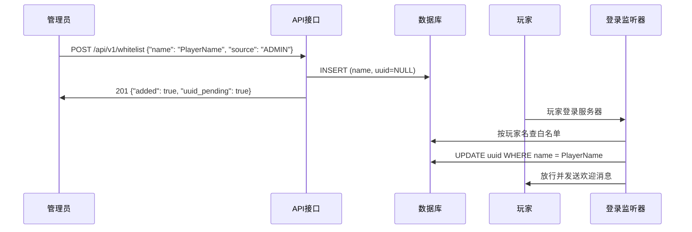

# AccessHub API 文档

> 本文档对应 Forge mod `shinoyuki_accesshub`（入口 `AccessHubMod`，包 `com.shinoyuki.accesshub`）。
> 仓库内另有一套 `com.xaoxiao.convenientaccess` 遗留 Bukkit 插件代码，**不再对外提供服务**，本文档不描述它。

## 概述

AccessHub 通过内置 Jetty 暴露一套 RESTful API，用于管理 Minecraft 1.20.1 Forge 服务端的白名单、查询玩家数据与服务器性能。除物品图标端点返回 `image/png` 外，所有端点返回 JSON。

白名单采用"玩家名优先，UUID 后补"策略：加白只需玩家名，UUID 在玩家首次登录时由登录监听器自动补充。

## 快速导航

- [基础信息](#基础信息) - 端口、编码等基础配置
- [认证系统](#认证系统) - 三类端点的鉴权方式与配置位置
- [所有可用端点](#所有可用端点) - 完整路由表（以 `ApiRouter` 为准）
- [响应格式](#响应格式) - 两种响应包装的差异
- [白名单管理 API](#白名单管理-api)
- [管理员认证 API](#管理员认证-api)
- [操作日志 API](#操作日志-api)
- [玩家数据查询 API](#玩家数据查询-api)
- [服务器监控 API](#服务器监控-api)
- [物品图标 API](#物品图标-api)
- [UUID 自动补充机制](#uuid-自动补充机制)
- [错误代码说明](#错误代码说明)

## 基础信息

- **基础 URL**: `http://your-server:22222/api/v1`
- **内容类型**: `application/json`
- **字符编码**: `UTF-8`
- **默认端口**: `22222`（`http.port`），监听地址默认 `0.0.0.0`（`http.host`）
- **认证方式**: `X-API-Key`（API 令牌）或 `Authorization: Bearer <jwt>`（管理员 JWT）
- **频率限制**: 服务端**未实现** HTTP 层限流。仅 `/api/v1/player` 有并发闸门（最多 5 个并发查询），`/api/v1/admin/login` 有登录失败次数限制。

## 认证系统

### 配置位置

配置文件为 MC 服务端下的 `config/Shinoyuki-Optimize/shinoyuki_accesshub/common.toml`（TOML，非 YAML）：

```toml
[api.auth]
# 是否启用 API 鉴权 (生产环境强烈建议开启)
enabled = true
# 管理员密码 (首次启动自动生成 12 位)
admin-password = "xxxxxxxxxxxx"
# API 访问令牌 (首次启动自动生成 sk- 开头的 64 位)
api-token = "sk-xxxxxxxxxxxxxxxxxxxxxxxxxxxxxxxxxxxxxxxxxxxxxxxxxxxxxxxxxxxxx"
token-prefix = "sk-"
# JWT 签名密钥 (首次启动生成 base64 256 位强随机). 修改此值会让所有已签发的 token 立即失效
jwt-secret = "..."

[api.auth.login-attempt-limit]
enabled = true
max-attempts = 5
lock-duration-minutes = 15
```

首次启动时 `api-token`、`admin-password`、`jwt-secret` 若为空会自动生成并写回配置文件，同时以 WARN 级别打印到控制台（仅此一次），请当场记录。

### 三类端点

鉴权逻辑全部集中在 `ApiRouter.isAuthenticated` / `ApiRouter.isPublicEndpoint`：

#### 1. 公开端点（无需任何凭据）

**只有以下三个**，其余端点一律需要凭据：

- `POST /api/v1/admin/login`
- `POST /api/v1/admin/register`
- `GET /api/v1/item-icon`（`` 标签无法携带自定义请求头，故必须公开）

#### 2. API 令牌端点（`X-API-Key`）

除公开端点与"仅管理员 JWT"端点外，全部端点都可用 API 令牌访问：

```bash
curl -H "X-API-Key: sk-your-api-token-here" \
     -X GET http://your-server:22222/api/v1/whitelist
```

令牌值取自 `[api.auth] api-token`，服务端以 `MessageDigest.isEqual` 做定长比较（防时序攻击）。

> **注意**：API 令牌**不能**放进 `Authorization: Bearer` 头。该头只走 JWT 校验分支，用 `sk-` 令牌会校验失败并返回 401。

#### 3. 管理员 JWT 端点（`Authorization: Bearer <jwt>`）

JWT 由 `POST /api/v1/admin/login` 签发，有效期 24 小时。

```bash
curl -H "Authorization: Bearer eyJhbGciOi..." \
     -X GET http://your-server:22222/api/v1/admin/me
```

- `GET /api/v1/admin/me` **只认 JWT**：该端点在路由层放行 `X-API-Key`，但控制器会自行从 `Authorization: Bearer` 或 `X-Auth-Token` 头取 JWT，只带 `X-API-Key` 会拿到 401 `未提供认证token`。
- 携带有效 JWT 调用 `POST /api/v1/whitelist` 时，服务端会用登录管理员的显示名覆盖请求体中的 `added_by_name`，并把 `added_by_uuid` 记为 `WEBUI`（渠道标记，客户端无法伪造）。

> 服务端**不存在** `X-Admin-Password` 请求头的校验逻辑，请勿使用。`[api.auth] admin-password` 仅用于初始化内置超级管理员账号。

### 认证失败响应

```json
{"success":false,"error":"Unauthorized: Invalid API key or token"}
```

HTTP 状态码 401。

### 禁用认证

把 `[api.auth] enabled` 设为 `false` 后，`isAuthenticated` 直接返回 true，所有端点无凭据可访问。仅限完全隔离的内网环境使用。

## 所有可用端点

以下路由表逐条对应 `ApiRouter` 中的 `path.equals(...)` / `path.startsWith(...)` 分支，未列出的路径一律返回 404。

### 白名单管理

| 端点 | 方法 | 描述 | 认证要求 |
|------|------|------|----------|
| `/api/v1/whitelist` | GET | 获取白名单列表（分页、搜索、排序，含被禁用条目） | X-API-Key 或 JWT |
| `/api/v1/whitelist` | POST | 添加白名单条目（仅需玩家名） | X-API-Key 或 JWT |
| `/api/v1/whitelist/batch` | POST | 批量操作（add / remove / enable / disable） | X-API-Key 或 JWT |
| `/api/v1/whitelist/regcode` | POST | 为指定玩家名签发一次性码（仅发码，不加白；`/register` 已停用校验，码仅供 `/enroll`） | X-API-Key 或 JWT |
| `/api/v1/whitelist/stats` | GET | 获取白名单统计信息 | X-API-Key 或 JWT |
| `/api/v1/whitelist/sync` | POST | 兼容桩，JSON 同步已移除 | X-API-Key 或 JWT |
| `/api/v1/whitelist/sync/status` | GET | 兼容桩，返回纯数据库模式标记 | X-API-Key 或 JWT |
| `/api/v1/whitelist/by-name/{name}/status` | PUT | 启用/禁用指定玩家的白名单访问权限 | X-API-Key 或 JWT |
| `/api/v1/whitelist/by-name/{name}` | DELETE | 按玩家名删除白名单条目 | X-API-Key 或 JWT |
| `/api/v1/whitelist/{uuid}` | DELETE | 按 UUID 删除白名单条目 | X-API-Key 或 JWT |

### 管理员认证

| 端点 | 方法 | 描述 | 认证要求 |
|------|------|------|----------|
| `/api/v1/admin/login` | POST | 管理员登录，返回 JWT | 无（公开） |
| `/api/v1/admin/register` | POST | 管理员注册，需注册令牌 | 无（公开，令牌在请求体内校验） |
| `/api/v1/admin/me` | GET | 获取当前管理员信息 | 仅管理员 JWT |
| `/api/v1/admin/generate-token` | POST | 生成管理员注册令牌 | X-API-Key 或 JWT |

### 操作日志

| 端点 | 方法 | 描述 | 认证要求 |
|------|------|------|----------|
| `/api/v1/logs/operations` | GET | 查询白名单操作日志 | X-API-Key 或 JWT |
| `/api/v1/logs/operations/stats` | GET | 按操作类型统计日志条数 | X-API-Key 或 JWT |

### 玩家与服务器 API

| 端点 | 方法 | 描述 | 认证要求 |
|------|------|------|----------|
| `/api/v1/player` | GET | 获取单个玩家详细数据（`?name=玩家名`） | X-API-Key 或 JWT |
| `/api/v1/server/players` | GET | 获取在线玩家列表 | X-API-Key 或 JWT |
| `/api/v1/server/performance` | GET | 获取服务器性能数据（Spark + JVM） | X-API-Key 或 JWT |
| `/api/v1/item-icon` | GET | 按物品 id 返回贴图 PNG（`?id=ns:path`） | 无（公开） |

> **已不存在的端点**：`/api/v1/health`、`/api/v1/server/info`、`/api/v1/server/status`、`/api/v1/players/online`、`/api/v1/players/list`、`/api/v1/worlds/list`、`/api/v1/system/resources`、`/api/v1/register` 在当前实现中均无路由分支，请求会返回 404。在线玩家列表请改用 `/api/v1/server/players`。

## 响应格式

### 控制器响应（`ApiResponse`）

绝大多数端点由控制器经 `ApiResponse` 输出，Gson 默认不序列化 null，因此值为 null 的字段会**整个键缺失**，客户端应按"字段不存在"处理。

成功：

```json
{
  "success": true,
  "data": { },
  "message": "成功获取在线玩家列表",
  "code": 200,
  "timestamp": "2026-08-02T08:59:00.217"
}
```

失败：

```json
{
  "success": false,
  "error": "玩家不存在",
  "code": 404,
  "timestamp": "2026-08-02T08:59:00.217"
}
```

- `timestamp` 是 ISO-8601 本地时间字符串（`yyyy-MM-ddTHH:mm:ss[.SSS]`），**不是**毫秒数。
- `message` 仅在控制器显式传入时才存在。
- **`code` 字段不可靠，请以 HTTP 状态码为准**：`ApiResponse.success(...)` 恒把 `code` 置为 200（即使 HTTP 是 201/207），`ApiResponse.error(...)` 恒置为 500（即使 HTTP 是 409/429/504），只有 `badRequest` / `notFound` 的 400 / 404 与 HTTP 一致。

### 路由器响应（`ApiRouter` 自身产生的错误）

路径不匹配、方法不支持、handler 未就绪、以及未捕获异常这四类错误由 `ApiRouter` 直接拼串输出，结构不同：

```json
{
  "success": false,
  "error": {
    "code": 404,
    "message": "API endpoint not found"
  },
  "timestamp": 1754103540217
}
```

此处 `error` 是对象，`timestamp` 是毫秒数。物品图标端点的错误响应也是这种结构。

## 白名单管理 API

### `GET /api/v1/whitelist`

分页获取白名单列表。该端点供后台管理界面使用，**固定返回全部条目（含 `isActive=false` 的被禁用条目）**。

**查询参数：**

| 参数 | 说明 |
|------|------|
| `page` | 页码，默认 1 |
| `size` | 每页大小，默认 20，上限 999999 |
| `search` | 玩家名模糊匹配（`name LIKE %值%`） |
| `source` | 来源精确匹配，自动转大写 |
| `added_by` | 添加者名模糊匹配（`added_by_name LIKE %值%`） |
| `sort` | 排序字段：`name` / `uuid` / `added_by`(`added_by_name`) / `added_at` / `source` / `created_at` / `updated_at`，非法值回落到 `created_at` |
| `order` | `asc` / `desc`，默认 `desc` |
| `start_date` | 起始时间，作用于 `added_at >= 值` |
| `end_date` | 结束时间，作用于 `added_at <= 值` |

**响应示例：**

```json
{
  "success": true,
  "data": {
    "items": [
      {
        "id": 1,
        "name": "Player1",
        "uuid": "550e8400-e29b-41d4-a716-446655440000",
        "addedByName": "AdminUser",
        "addedByUuid": "WEBUI",
        "addedAt": "2026-08-01T12:00:00",
        "source": "ADMIN",
        "isActive": true,
        "qq": "10001",
        "createdAt": "2026-08-01T12:00:00",
        "updatedAt": "2026-08-01T12:00:00"
      },
      {
        "id": 2,
        "name": "Player2",
        "addedByName": "API",
        "addedByUuid": "API",
        "addedAt": "2026-08-01T13:00:00",
        "source": "SYSTEM",
        "isActive": true,
        "createdAt": "2026-08-01T13:00:00",
        "updatedAt": "2026-08-01T13:00:00"
      }
    ],
    "page": 1,
    "size": 20,
    "total": 100,
    "pages": 5
  },
  "code": 200,
  "timestamp": "2026-08-02T08:59:00.217"
}
```

> **字段命名**：响应键为 Java 字段名的驼峰形式（`addedByName` / `isActive` / `createdAt`），**不是** snake_case。
>
> **UUID 待补充**：如上例中的 `Player2`，`uuid` 为 null 时该键直接缺失。此列表**不包含** `uuid_pending` 字段，请以"是否存在 `uuid` 键"判断。`qq` 为 null 时同理缺失。
>
> **关于 `isActive`**：`false` 表示玩家仍在白名单中、但被管理员关闭了访问权限，进服时会被拒并展示 `whitelist.disabled-message`（默认"您已在白名单中，但管理员手动关闭了您的访问权限"）。可通过 `PUT .../status` 端点切换。

### `POST /api/v1/whitelist`

添加白名单条目。只需玩家名，UUID 在玩家首次登录时自动补充。

**请求体：**

```json
{
  "name": "PlayerName",
  "source": "ADMIN",
  "added_by_name": "AdminName",
  "added_by_uuid": "API",
  "added_at": "2026-08-01T12:00:00",
  "qq": "10001"
}
```

**参数说明：**

- `name`（必需）：玩家名。控制器只校验长度 1-64；但底层 `WhitelistManager` 要求 **3-16 位 `[a-zA-Z0-9_]`**，不满足会静默返回失败 → HTTP 409。
- `source`（必需）：来源，枚举 `WhitelistEntry.Source` 只接受 **`PLAYER`、`ADMIN`、`SYSTEM`** 三个值。传其它值（含 `API`）返回 400 `来源类型无效`。
- `added_by_name`（可选）：添加者名，缺省 `API`。
- `added_by_uuid`（可选）：添加者标识，兼作渠道标记，缺省 `API`。仅在提供了 `added_by_name` 时才读取此字段。
- `added_at`（可选）：ISO-8601 本地时间，缺省当前时间；格式错误返回 400。
- `qq`（可选）：联系 QQ，空串归一为 null。

> 携带管理员 JWT 调用时，`added_by_name` / `added_by_uuid` 会被服务端强制覆盖为管理员显示名 / `WEBUI`，请求体中的同名字段被忽略。

**最简请求：**

```json
{ "name": "PlayerName", "source": "ADMIN" }
```

**成功响应（HTTP 201）：**

```json
{
  "success": true,
  "data": {
    "name": "PlayerName",
    "added": true,
    "uuid_pending": true,
    "message": "玩家已添加到白名单，UUID将在首次登录时自动补充",
    "registration_code": "ABCD-2345",
    "code_expires_minutes": 1440
  },
  "message": "玩家添加成功",
  "code": 200,
  "timestamp": "2026-08-02T08:59:00.217"
}
```

`registration_code` / `code_expires_minutes` 仅在玩家离线认证启用（`[auth] enabled = true`）时随回执一并签发，否则这两个键缺席。

**错误：** 缺少 `name` 或 `source` 返回 400；玩家已在白名单中或写库失败返回 409 `玩家已在白名单中或添加失败`。

### `DELETE /api/v1/whitelist/{uuid}`

按 UUID 删除。`{uuid}` 必须匹配标准 36 位带连字符格式，否则 400。

**响应示例：**

```json
{
  "success": true,
  "data": {
    "uuid": "550e8400-e29b-41d4-a716-446655440000",
    "name": "PlayerName",
    "removed": true
  },
  "message": "玩家移除成功",
  "code": 200,
  "timestamp": "2026-08-02T08:59:00.217"
}
```

**错误：** UUID 格式非法 400；条目不存在 404。

### `DELETE /api/v1/whitelist/by-name/{name}`

按玩家名删除，用于 UUID 尚未补充的条目。`{name}` 需 URL 编码，服务端会解码。若条目已有 UUID 则按 UUID 删除，否则按名删除。

**响应示例：**

```json
{
  "success": true,
  "data": {
    "name": "PlayerName",
    "uuid": "550e8400-e29b-41d4-a716-446655440000",
    "removed": true
  },
  "message": "玩家移除成功",
  "code": 200,
  "timestamp": "2026-08-02T08:59:00.217"
}
```

条目 UUID 为空时 `uuid` 键缺席。**错误：** 名称非法 400；条目不存在 404。

### `PUT /api/v1/whitelist/by-name/{name}/status`

启用/禁用指定玩家的白名单访问权限（按玩家名定位，因 UUID 待补充的条目 `uuid` 为空）。

禁用（`is_active=false`）后，该玩家**仍保留在白名单中**，但进服会被拒绝并展示 `whitelist.disabled-message`。重新启用即恢复访问。与 `DELETE` 的区别：禁用是可逆的临时关停，不删除条目、不丢失 QQ 与添加者信息。

`{name}` 需做 URL 编码。

**请求体：**

```json
{ "is_active": false }
```

**响应示例：**

```json
{
  "success": true,
  "data": {
    "name": "PlayerName",
    "is_active": false
  },
  "message": "已禁用",
  "code": 200,
  "timestamp": "2026-08-02T08:59:00.217"
}
```

**错误：** 玩家名非法或缺少 `is_active` 返回 400；玩家不存在返回 404。

### `POST /api/v1/whitelist/batch`

批量操作，`operation` 支持 `add`、`remove`、`enable`、`disable`（大小写不敏感）。单次最多 100 个玩家，`players` 不可为空。

**批量添加：**

```json
{
  "operation": "add",
  "source": "ADMIN",
  "added_by_name": "AdminName",
  "added_by_uuid": "00000000-0000-0000-0000-000000000000",
  "added_at": "2026-08-01T12:00:00",
  "players": [
    { "name": "Player1" },
    { "name": "Player2", "uuid": "550e8400-e29b-41d4-a716-446655440000" }
  ]
}
```

> **批量添加与单条添加的关键差异**：批量添加会立即为每个玩家写入 UUID —— 未提供 `uuid` 时由 `UuidUtils.getOrGenerateUuid` 按玩家名 MD5 生成确定性 UUID（version 3 形态），**不走登录补充流程**。若服务器为正版验证模式，该生成值与玩家真实 UUID 不一致。需要 UUID 自动补充语义时请逐个调用 `POST /api/v1/whitelist`。

**批量删除**（按 `uuid` 定位，每个元素必须有合法 `uuid`）：

```json
{
  "operation": "remove",
  "added_by_name": "AdminName",
  "players": [
    { "uuid": "550e8400-e29b-41d4-a716-446655440000" },
    { "uuid": "550e8400-e29b-41d4-a716-446655440001" }
  ]
}
```

**批量启用/禁用**（按 `name` 定位，无需 `source` / `added_by_*`）：

```json
{
  "operation": "disable",
  "players": [
    { "name": "Player1" },
    { "name": "Player2" }
  ]
}
```

**参数说明：** `operation` 与 `players` 必需；`source` 仅 `add` 必需，取值同样限于 `PLAYER` / `ADMIN` / `SYSTEM`；`added_by_name` 缺省 `API`，`added_by_uuid` 缺省 `00000000-0000-0000-0000-000000000000`（仅 `add` / `remove` 读取）。

**响应示例：**

```json
{
  "success": true,
  "data": {
    "operation": "add",
    "total_requested": 2,
    "success_count": 2,
    "failure_count": 0,
    "success_rate": 1.0,
    "registration_codes_pending": true,
    "registration_codes_hint": "批量加白未逐个签发注册码, 请在游戏内执行 /accesshub auth gencode 为未注册白名单玩家批量补发"
  },
  "message": "批量添加完成",
  "code": 200,
  "timestamp": "2026-08-02T08:59:00.217"
}
```

- 全部成功 HTTP 200，部分成功 HTTP **207**，全部失败 HTTP 400。
- `success_rate` 是 **0..1 的比例**（`success_count / total_requested`），不是百分比。
- 存在失败项时追加 `errors` 数组（元素为服务端产生的错误描述）。
- `registration_codes_pending` / `registration_codes_hint` 仅在玩家离线认证启用且至少成功一条时出现：批量加白**不会**逐个签发注册码。

### `POST /api/v1/whitelist/regcode`

> 注册码校验自 0.2.6 起临时停用：玩家 `/register <密码> <确认密码>` 两参数即可注册，不再需要码。
> 本端点与下面的发码字段仍然可用，但签发出来的码当前只对 `/enroll`（换机免密登记）有效。

为指定玩家名签发一次性注册码，仅发码、不改动白名单。与 `POST /api/v1/whitelist`（加白即发码）解耦：当玩家已在白名单（如问卷审核时已加白）时再调加白会撞 409 拿不到码，此端点直接重签注册码，与白名单状态无关。内部会作废该玩家名名下旧的未用码，保证同名同时只有一个有效码；仅返回明文码一次，库内只存其 SHA-256 哈希，明文码不写入操作日志。

主要供问卷后端在玩家凭 hash 自助领码时以服务端身份调用。需玩家离线认证（`common.toml` 的 `[auth] enabled`）启用，否则返回 409。

**请求体：**

```json
{ "name": "PlayerName" }
```

**响应示例：**

```json
{
  "success": true,
  "data": {
    "name": "PlayerName",
    "registration_code": "ABCD-2345",
    "code_expires_minutes": 1440
  },
  "message": "注册码已生成",
  "code": 200,
  "timestamp": "2026-08-02T08:59:00.217"
}
```

**说明：**

- 注册码绑定该玩家名、一次性、`code_expires_minutes` 分钟后过期（`[auth] code-expiry-minutes`，默认 1440）。原用途是游戏内 `/register <密码> <确认> <注册码>`；0.2.6 起 `/register` 不再校验码，该码仅供 `/enroll <码>` 换机登记。
- 缺少 `name` 或名称非法返回 400；玩家认证未启用返回 409 `玩家认证未启用, 无法签发注册码`；生成失败返回 500。

### `GET /api/v1/whitelist/stats`

**响应示例：**

```json
{
  "success": true,
  "data": {
    "totalPlayers": 150,
    "activePlayers": 148,
    "sourceCounts": {
      "ADMIN": 120,
      "SYSTEM": 25,
      "PLAYER": 3
    },
    "recentAdditions": 5,
    "growthTrend": "stable"
  },
  "code": 200,
  "timestamp": "2026-08-02T08:59:00.217"
}
```

**字段说明：**

| 字段 | 说明 |
|------|------|
| `totalPlayers` | 白名单总条目数（含被禁用） |
| `activePlayers` | `is_active = 1` 的条目数 |
| `sourceCounts` | 按 `source` 分组计数，**只统计 `is_active = 1` 的条目** |
| `recentAdditions` | 最近 24 小时内 `created_at` 落入的新增数 |
| `growthTrend` | 恒为 `"stable"`，趋势计算未实现，请勿依赖 |

> 该端点**不返回** UUID 待补充数、删除数、同步状态或缓存状态，这些字段在当前实现中不存在。

### `POST /api/v1/whitelist/sync`

JSON 同步功能已移除，此端点保留为兼容桩，不执行任何同步动作，恒返回 HTTP 200：

```json
{
  "success": true,
  "data": {
    "message": "JSON同步功能已移除,系统现在使用纯数据库模式",
    "mode": "database-only"
  },
  "code": 200,
  "timestamp": "2026-08-02T08:59:00.217"
}
```

### `GET /api/v1/whitelist/sync/status`

同为兼容桩：

```json
{
  "success": true,
  "data": {
    "mode": "database-only",
    "json_sync": "disabled",
    "message": "系统运行在纯数据库模式"
  },
  "code": 200,
  "timestamp": "2026-08-02T08:59:00.217"
}
```

## 管理员认证 API

### `POST /api/v1/admin/login`

公开端点。用户名 + 密码换取 JWT，有效期 24 小时。

**请求体：**

```json
{ "username": "admin", "password": "your-password" }
```

**响应示例：**

```json
{
  "success": true,
  "data": {
    "token": "eyJhbGciOiJIUzI1NiJ9....",
    "user": {
      "id": 1,
      "username": "admin",
      "displayName": "管理员",
      "isSuperAdmin": true,
      "isAdmin": true
    }
  },
  "message": "登录成功",
  "code": 200,
  "timestamp": "2026-08-02T08:59:00.217"
}
```

**错误：** 缺少 `username` / `password` 或为空返回 400；凭据错误或账号被锁返回 401（消息来自认证服务）。连续失败达 `[api.auth.login-attempt-limit] max-attempts`（默认 5）后锁定 `lock-duration-minutes`（默认 15）分钟。

### `POST /api/v1/admin/register`

公开端点，但请求体内必须携带有效的注册令牌（由 `POST /api/v1/admin/generate-token` 生成）。

**请求体：**

```json
{
  "username": "newadmin",
  "password": "your-password",
  "token": "reg_xxxxxxxxxxxxxxxxxxxxxxxxxxxx",
  "displayName": "新管理员"
}
```

**参数说明：**

- `username`（必需）：`^[a-zA-Z0-9_]{3,20}$`
- `password`（必需）：长度 6-50
- `token`（必需）：注册令牌，`reg_` 前缀，一次性
- `displayName`（可选）：缺省等于 `username`

**响应示例：**

```json
{
  "success": true,
  "data": {
    "username": "newadmin",
    "message": "注册成功"
  },
  "message": "注册成功",
  "code": 200,
  "timestamp": "2026-08-02T08:59:00.217"
}
```

**错误：** 参数缺失/格式不合规/令牌无效/用户名已存在均返回 400。

### `GET /api/v1/admin/me`

**仅接受管理员 JWT**，从 `Authorization: Bearer <jwt>` 或 `X-Auth-Token: <jwt>` 头读取。

**响应示例：**

```json
{
  "success": true,
  "data": {
    "id": 1,
    "username": "admin",
    "displayName": "管理员",
    "email": "admin@example.com",
    "isSuperAdmin": true,
    "isAdmin": true
  },
  "message": "获取成功",
  "code": 200,
  "timestamp": "2026-08-02T08:59:00.217"
}
```

`email` 为 null 时该键缺席。**错误：** 未提供 token 返回 401 `未提供认证token`；token 无效或过期返回 401 `认证失败或token已过期`。

### `POST /api/v1/admin/generate-token`

生成管理员注册令牌。路由层鉴权，`X-API-Key` 与管理员 JWT 均可通过。

**请求体（可选，可为空体）：**

```json
{ "expiryHours": 24 }
```

`expiryHours` 缺省 24，取值须在 1-168 之间，越界返回 400。请求体解析失败时回落到默认值。

**响应示例：**

```json
{
  "success": true,
  "data": {
    "token": "reg_xxxxxxxxxxxxxxxxxxxxxxxxxxxx",
    "expiryHours": 24,
    "message": "令牌生成成功"
  },
  "message": "令牌生成成功",
  "code": 200,
  "timestamp": "2026-08-02T08:59:00.217"
}
```

令牌形如 `reg_` + 28 位 URL-safe Base64 字符，总长 32。该令牌用于 `POST /api/v1/admin/register`。

## 操作日志 API

### `GET /api/v1/logs/operations`

**查询参数：**

| 参数 | 说明 |
|------|------|
| `type` | 操作类型精确匹配 |
| `target_uuid` | 目标玩家 UUID |
| `target_name` | 目标玩家名 |
| `operator_ip` | 操作者 IP |
| `start_time` | 起始时间，ISO-8601 `yyyy-MM-ddTHH:mm:ss`，格式错误返回 400 |
| `end_time` | 结束时间，同上 |
| `limit` | 返回条数，默认 100，上限 1000，非法值回落 100 |
| `offset` | 偏移量，默认 0，负数归零 |

**响应示例：**

```json
{
  "success": true,
  "data": {
    "logs": [
      {
        "id": 1,
        "operation_type": "ADD",
        "target_uuid": "550e8400-e29b-41d4-a716-446655440000",
        "target_name": "PlayerName",
        "operator_ip": "127.0.0.1",
        "operator_agent": "curl/8.4.0",
        "request_data": "{\"name\":\"PlayerName\",\"source\":\"ADMIN\"}",
        "response_status": 201,
        "execution_time": 12,
        "created_at": "2026-08-02T08:59:00"
      }
    ],
    "total": 1,
    "limit": 100,
    "offset": 0,
    "has_more": false
  },
  "message": "查询成功",
  "code": 200,
  "timestamp": "2026-08-02T08:59:00.217"
}
```

> 当前实际写入日志的操作类型只有 4 种，全部来自白名单端点：`ADD`、`REMOVE`、`SET_ACTIVE`、`GENCODE`。`execution_time` 单位为毫秒；`operator_ip` 优先取 `X-Forwarded-For` 首段，其次 `X-Real-IP`，最后连接远端地址。

### `GET /api/v1/logs/operations/stats`

**查询参数：** `start_time`、`end_time`（同上，格式错误返回 400）。

**响应示例：**

```json
{
  "success": true,
  "data": {
    "add": 120,
    "remove": 8,
    "batch_add": 0,
    "batch_remove": 0,
    "update": 0,
    "total": 131
  },
  "message": "统计成功",
  "code": 200,
  "timestamp": "2026-08-02T08:59:00.217"
}
```

> 该端点按硬编码的 `ADD` / `REMOVE` / `BATCH_ADD` / `BATCH_REMOVE` / `UPDATE` 五类分别计数。由于当前无处写入 `BATCH_*` / `UPDATE`，这三项恒为 0；而实际存在的 `SET_ACTIVE` 与 `GENCODE` 不出现在分项里，只计入 `total`，因此**分项之和通常小于 `total`**。

## 玩家数据查询 API

### `GET /api/v1/player`

获取单个玩家的详细数据。在线玩家读取实时状态，离线玩家直接解析 `playerdata/<uuid>.dat` 的压缩 NBT。

**查询参数：**

- `name`（必需）：玩家名，为空返回 400
- `includeOffline`（可选）：`true` 时允许查询离线玩家，默认 `false`

**请求示例：**

```bash
curl -H "X-API-Key: sk-your-api-token-here" \
     -X GET "http://your-server:22222/api/v1/player?name=PlayerName"

curl -H "X-API-Key: sk-your-api-token-here" \
     -X GET "http://your-server:22222/api/v1/player?name=PlayerName&includeOffline=true"
```

**响应示例（在线玩家）：**

```json
{
  "success": true,
  "data": {
    "playerName": "PlayerName",
    "uuid": "550e8400-e29b-41d4-a716-446655440000",
    "online": true,
    "gameMode": "survival",
    "ping": 62,
    "location": {
      "dimension": "minecraft:overworld",
      "x": -4626.93,
      "y": 71.59,
      "z": 20.71,
      "yaw": 90.0,
      "pitch": 0.0
    },
    "vitals": {
      "health": 20.0,
      "maxHealth": 20.0,
      "armor": 15,
      "foodLevel": 20,
      "saturation": 5.0,
      "exhaustion": 0.0,
      "level": 30,
      "exp": 0.5,
      "totalExperience": 825,
      "remainingAir": 300,
      "maximumAir": 300,
      "fireTicks": 0
    },
    "state": {
      "flying": false,
      "allowFlight": false,
      "invulnerable": false,
      "walkSpeed": 0.1,
      "flySpeed": 0.05,
      "sneaking": false,
      "sprinting": false,
      "swimming": false,
      "gliding": false
    },
    "potionEffects": [
      {
        "type": "minecraft:speed",
        "amplifier": 1,
        "duration": 600,
        "ambient": false,
        "visible": true,
        "showIcon": true
      }
    ],
    "inventory": {
      "main": [
        {
          "type": "minecraft:diamond_sword",
          "amount": 1,
          "slot": "0",
          "damage": 0,
          "maxDurability": 1561,
          "displayName": "传奇之剑",
          "enchantments": {
            "minecraft:sharpness": 5,
            "minecraft:unbreaking": 3
          }
        }
      ],
      "armor": [
        {
          "type": "minecraft:diamond_helmet",
          "amount": 1,
          "slot": "head",
          "damage": 10,
          "maxDurability": 363,
          "enchantments": { "minecraft:protection": 4 }
        }
      ],
      "offHand": {
        "type": "minecraft:torch",
        "amount": 64,
        "slot": "offhand"
      }
    },
    "enderChest": [
      { "type": "minecraft:diamond", "amount": 64, "slot": "0" }
    ]
  },
  "message": "成功获取玩家数据(在线)",
  "code": 200,
  "timestamp": "2026-08-02T08:59:00.217"
}
```

**响应示例（离线玩家，`includeOffline=true`）：**

```json
{
  "success": true,
  "data": {
    "playerName": "PlayerName",
    "uuid": "550e8400-e29b-41d4-a716-446655440000",
    "online": false,
    "source": "offline-nbt",
    "lastSaved": "2026-08-01T20:13:44.512Z",
    "gameMode": "survival",
    "location": {
      "dimension": "minecraft:overworld",
      "x": -4626.93,
      "y": 71.59,
      "z": 20.71,
      "yaw": 90.0,
      "pitch": 0.0
    },
    "vitals": {
      "health": 20.0,
      "foodLevel": 20,
      "saturation": 5.0,
      "exhaustion": 0.0,
      "level": 30,
      "exp": 0.5,
      "totalExperience": 825,
      "remainingAir": 300,
      "fireTicks": 0
    },
    "state": {
      "flying": false,
      "allowFlight": false,
      "invulnerable": false,
      "walkSpeed": 0.1,
      "flySpeed": 0.05
    },
    "potionEffects": [],
    "inventory": { "main": [], "armor": [] },
    "enderChest": []
  },
  "message": "成功获取玩家数据(离线)",
  "code": 200,
  "timestamp": "2026-08-02T08:59:00.217"
}
```

**在线与离线的结构差异：**

| 差异点 | 说明 |
|--------|------|
| `source` / `lastSaved` | 仅离线有；`lastSaved` 为 `.dat` 文件修改时间（ISO-8601 UTC 瞬时） |
| `ping` | 仅在线有 |
| `vitals.maxHealth` / `vitals.armor` / `vitals.maximumAir` | 仅在线有。离线 NBT 无法可靠还原属性修饰符，故刻意省略而不给假值 |
| `state.sneaking` / `sprinting` / `swimming` / `gliding` | 仅在线有，这些是运行期瞬时状态，不落盘 |

**字段说明：**

| 字段 | 类型 | 说明 |
|------|------|------|
| `playerName` | string | 玩家名 |
| `uuid` | string | 玩家 UUID |
| `online` | boolean | 是否在线（**字段名为 `online`，不是 `isOnline`**） |
| `gameMode` | string | 游戏模式，小写：`survival` / `creative` / `adventure` / `spectator` |
| `ping` | int | 延迟毫秒（仅在线） |
| `location.dimension` | string | 维度注册名，如 `minecraft:overworld`（**不是** `NORMAL`/`NETHER`） |
| `location.x/y/z` | double | 坐标 |
| `location.yaw/pitch` | float | 视角 |
| `vitals.*` | - | 生命/饱食/经验/空气/燃烧等数值 |
| `state.*` | - | 飞行能力与运动状态 |
| `potionEffects[].type` | string | 效果注册名，如 `minecraft:speed` |
| `inventory.main` | array | 主背包 36 格（含快捷栏），`slot` 为 `"0"`-`"35"` |
| `inventory.armor` | array | 盔甲栏，`slot` 取 `feet` / `legs` / `chest` / `head` |
| `inventory.offHand` | object | 副手物品，`slot` 为 `offhand`；副手为空时该键缺席 |
| `enderChest` | array | 末影箱物品 |
| 物品 `type` | string | 物品注册名，如 `minecraft:diamond_sword` |
| 物品 `damage` / `maxDurability` | int | 仅可损耗物品才有 |
| 物品 `displayName` | string | 仅设置了自定义名称才有 |
| 物品 `enchantments` | object | 附魔注册名 → 等级，无附魔时该键缺席 |

> 空槽位不会出现在数组中；`inventory` 的 `main` / `armor` 是压缩后的稀疏列表，需靠 `slot` 定位。

**错误响应：**

```json
{
  "success": false,
  "error": "玩家不在线 (提示: 加 ?includeOffline=true 查询离线玩家基本信息)",
  "code": 404,
  "timestamp": "2026-08-02T08:59:00.217"
}
```

| HTTP | 场景 |
|------|------|
| 400 | 缺少 `name` 参数 |
| 404 | 玩家不在线且未加 `includeOffline`；或玩家不存在 / 从未登录过服务器 |
| 429 | `查询请求过多, 请稍后再试`（并发闸门满） |
| 500 | 采集异常，或 `.dat` 文件损坏 |
| 504 | `服务器繁忙, 请稍后重试`（主线程任务超时） |

**注意事项：**

- 数据采集必须在服务器主线程执行，在线查询超时 3 秒、`includeOffline=true` 时 5 秒，超时返回 504。
- 并发上限 5（`Semaphore`），获取许可等待 100 毫秒，抢不到返回 429。
- 玩家名区分大小写（在线查找走 `getPlayerByName`，离线走 `GameProfileCache`）。
- v1 Bukkit 版的 `statistics`（游戏时长/死亡数/击杀数/伤害）**未移植**，当前实现不返回该字段。

## 服务器监控 API

### `GET /api/v1/server/players`

获取在线玩家列表（主线程采集，3 秒超时）。

**响应示例：**

```json
{
  "success": true,
  "data": {
    "count": 1,
    "maxPlayers": 114514,
    "players": [
      {
        "name": "xinglongge",
        "uuid": "ccbbc496-0000-0000-0000-000000000000",
        "dimension": "minecraft:overworld",
        "x": -4626.93,
        "y": 71.59,
        "z": 20.71,
        "health": 20,
        "ping": 62,
        "gameMode": "creative"
      }
    ]
  },
  "message": "成功获取在线玩家列表",
  "code": 200,
  "timestamp": "2026-08-02T08:59:00.217"
}
```

**错误：** 主线程繁忙超时返回 504 `获取在线玩家超时`；采集异常返回 500。

### `GET /api/v1/server/performance`

获取服务器性能数据。TPS / MSPT / CPU 来自 spark mod，内存 / GC / 线程始终来自 JVM MXBean。异步采集，5 秒超时。

**响应示例（spark 已加载，取自 Forge 1.20.1-47.4.0 生产实例）：**

```json
{
  "success": true,
  "data": {
    "source": "spark",
    "tps": {
      "available": true,
      "values": { "last_10s": 19.9998, "last_1m": 19.99996, "last_5m": 19.999998 },
      "server_load_percent": 0.000167
    },
    "mspt": {
      "available": true,
      "values": {
        "last_1m": { "mean": 0.8959, "max": 1.7136, "min": 0.6275, "percentile_95": 1.2496 },
        "last_5m": { "mean": 0.9233, "max": 52.691, "min": 0.6226, "percentile_95": 1.3215 }
      }
    },
    "cpu": {
      "available": true,
      "system":  { "last_10s": 0.00157, "last_1m": 0.00202, "last_15m": 0.00328 },
      "process": { "last_10s": 0.00613, "last_1m": 0.0063, "last_15m": 0.00768 }
    },
    "memory": {
      "heap": {
        "init": 25769803776,
        "used": 6215958528,
        "committed": 25769803776,
        "max": 25769803776,
        "usage_percent": 24.12
      },
      "non_heap": {
        "init": 12582912,
        "used": 405129080,
        "committed": 451280896,
        "max": 2147483648
      },
      "pools": {
        "zgc_old_generation": {
          "used": 3183476736,
          "committed": 3183476736,
          "max": 25769803776,
          "type": "HEAP"
        }
      },
      "source": "jvm"
    },
    "gc": {
      "collectors": {
        "zgc_cycles": { "collection_count": 42, "collection_time": 1180 }
      },
      "total_collections": 42,
      "total_time_ms": 1180,
      "average_time_per_collection": 28.09,
      "source": "jvm"
    },
    "threads": {
      "current_thread_count": 128,
      "daemon_thread_count": 96,
      "peak_thread_count": 141,
      "total_started_thread_count": 3120,
      "deadlocked_threads": 0,
      "source": "jvm"
    },
    "sparkAvailable": true
  },
  "message": "成功获取服务器性能数据",
  "code": 200,
  "timestamp": "2026-08-02T08:59:00.217"
}
```

**字段说明：**

| 字段 | 说明 |
|------|------|
| `source` | `"spark"` 或 `"fallback"`，标明数据来源 |
| `sparkAvailable` | 由 handler 附加，等价于"spark mod 已加载且 API 可用" |
| `tps.values` | 窗口固定为 **`last_10s` / `last_1m` / `last_5m`**（spark `StatisticWindow.TicksPerSecond` 的 `SECONDS_10` / `MINUTES_1` / `MINUTES_5`），**没有 `last_15m`** |
| `tps.server_load_percent` | 按 `(20 - last_1m) / 20 * 100` 计算的负载百分比 |
| `mspt.values` | 窗口为 `last_1m` / `last_5m`，每个窗口是含 `mean` / `max` / `min` / `percentile_95` 的对象，单位毫秒 |
| `cpu.system` / `cpu.process` | 窗口为 `last_10s` / `last_1m` / `last_15m`。**值是 0..1 的比例，不是百分比**（`0.00613` 即 0.613%） |
| `memory.heap` / `memory.non_heap` | 字节数；`usage_percent` 仅堆有，是百分比 |
| `memory.pools` | 键为内存池名（空格转下划线并转小写，如 `zgc_old_generation`），`type` 为 `HEAP` / `NON_HEAP` |
| `gc.collectors` | 键为 GC 名（同样小写化），`collection_time` 与 `total_time_ms` 单位毫秒 |
| `threads` | JVM 线程计数与死锁线程数 |

**spark 不可用时的降级结构：** `source` 变为 `"fallback"`，`sparkAvailable` 为 `false`，且：

- `tps`：三个窗口取同一个估算值（由 `MinecraftServer.getAverageTickTime()` 推算 `min(20, 1000/mspt)`），附加 `note` 字段说明来源。
- `mspt`：仅 `values.last_1m.mean` 一个数值，附加 `note` 字段。
- `cpu`：`available` 为 `false`，无 `system` / `process`，附加 `note: "CPU 详细数据需安装 spark mod"`。
- `memory` / `gc` / `threads`：与 spark 可用时完全一致。

此外，spark 可用但某项统计取数抛异常时，对应子对象退化为 `{"available": false, "error": "<异常信息>"}`，客户端应先判 `available` 再读 `values`。

**错误：** 采集超时返回 504 `获取性能数据超时`；异常返回 500。

## 物品图标 API

### `GET /api/v1/item-icon`

公开端点（`` 标签无法携带自定义头，故不鉴权）。从已加载的 mod jar 中抽取物品贴图 PNG。

**查询参数：**

- `id`（必需）：物品 id，形如 `minecraft:diamond_sword`。无冒号时首个 `/` 会被当作命名空间分隔符（`minecraft/diamond_sword` 等价）；无命名空间时默认 `minecraft`。字符白名单为 `[a-z0-9_.:/-]`，含 `..` 或越界字符返回 400。

**成功响应：** HTTP 200，`Content-Type: image/png`，`Cache-Control: public, max-age=86400`，响应体为 PNG 字节。

**解析顺序（best-effort）：**

1. `assets/<ns>/models/item/<path>.json` 的 `textures.layer0` 指向的贴图
2. 回退 `assets/<ns>/textures/item/<path>.png`
3. 回退 `assets/<ns>/textures/block/<path>.png`
4. 都没有则 404（前端应显示占位图）

**错误响应**（`ApiRouter` 风格的对象型 error）：

```json
{
  "success": false,
  "error": { "code": 404, "message": "未找到物品图标: minecraft:not_exist" },
  "timestamp": 1754103540217
}
```

命中结果与未命中结果都会按 id 缓存在内存中，避免重复扫描 jar。

## UUID 自动补充机制

### 设计理念

白名单采用**"玩家名优先，UUID 后补"**策略：

1. **添加阶段**：管理员只需提供玩家名即可加白，数据库中 `uuid` 列为 NULL
2. **登录阶段**：玩家首次登录时，`PlayerLoginListener` 调用 `WhitelistManager.updatePlayerUuid` 自动补齐 UUID
3. **持久化**：系统运行在纯数据库模式，无 JSON 文件同步环节

### 工作流程


```mermaid
sequenceDiagram
    participant Admin as 管理员
    participant API as API接口
    participant DB as 数据库
    participant Player as 玩家
    participant Listener as 登录监听器

    Admin->>API: POST /api/v1/whitelist {"name": "PlayerName", "source": "ADMIN"}
    API->>DB: INSERT (name, uuid=NULL)
    API->>Admin: 201 {"added": true, "uuid_pending": true}

    Player->>Listener: 玩家登录服务器
    Listener->>DB: 按玩家名查白名单
    Listener->>DB: UPDATE uuid WHERE name = PlayerName
    Listener->>Player: 放行并发送欢迎消息
```

### 数据库状态变化

**添加时：**

```
id | name       | uuid | source | is_active
1  | PlayerName | NULL | ADMIN  | 1
```

**首次登录后：**

```
id | name       | uuid                                 | source | is_active
1  | PlayerName | 550e8400-e29b-41d4-a716-446655440000 | ADMIN  | 1
```

### 适用范围

- 仅 `POST /api/v1/whitelist`（单条添加）走此流程。
- `POST /api/v1/whitelist/batch` 的 `add` 操作**立即写入生成的 UUID**，不走登录补充，详见批量端点说明。

## 错误代码说明

| HTTP 状态码 | 说明 | 常见来源 |
|------------|------|----------|
| 200 | 成功 | - |
| 201 | 创建成功 | `POST /api/v1/whitelist` |
| 207 | 批量操作部分成功 | `POST /api/v1/whitelist/batch` |
| 400 | 请求参数错误 | 缺少必需字段、格式非法、来源类型无效 |
| 401 | 认证失败 | 缺少/错误的 `X-API-Key` 或 JWT；管理员登录凭据错误 |
| 404 | 资源不存在 | 玩家条目不存在、玩家不在线、路径无对应路由 |
| 405 | 方法不支持 | 对已存在路径使用了未实现的方法 |
| 409 | 冲突 | 玩家已在白名单；玩家认证未启用而请求发码 |
| 429 | 并发超限 | `/api/v1/player` 并发查询超过 5 个 |
| 500 | 服务器内部错误 | 未捕获异常、数据库故障 |
| 503 | 依赖组件未就绪 | 对应 handler 尚未初始化（服务器启动早期） |
| 504 | 主线程/采集超时 | `/api/v1/player`、`/api/v1/server/*` |

> 再次提醒：响应体中的 `code` 字段与 HTTP 状态码可能不一致，请以 HTTP 状态码为准。

## 安全最佳实践

### API 令牌管理

- 令牌明文存放在服务端 `common.toml`，请限制该文件的读取权限
- 不要在前端代码里硬编码令牌；浏览器侧应走管理员 JWT
- 轮换令牌：修改 `[api.auth] api-token` 后重启服务端；置空则下次启动自动重新生成

### JWT 安全

- 有效期 24 小时，过期后需重新登录
- 修改 `[api.auth] jwt-secret` 会立即使所有已签发 token 失效，可作为紧急吊销手段
- 避免在 URL 中传递 token

### 网络安全

- API 默认监听 `0.0.0.0:22222` 且 CORS 默认允许全部来源（`api.cors.allowed-origins = ["*"]`），公网部署务必用防火墙或反向代理收口
- 需要 HTTPS 时在前置反向代理终结，mod 本身不提供 TLS
- 反代场景下服务端会读取 `X-Forwarded-For` / `X-Real-IP` 记录操作者 IP，请确保这两个头由可信代理设置

## 使用示例

### 白名单管理示例

```bash
# 1. 获取白名单列表
curl -X GET "http://localhost:22222/api/v1/whitelist?page=1&size=20" \
  -H "X-API-Key: sk-your-api-token-here"

# 2. 添加白名单条目（只需玩家名 + 来源）
curl -X POST http://localhost:22222/api/v1/whitelist \
  -H "Content-Type: application/json" \
  -H "X-API-Key: sk-your-api-token-here" \
  -d '{
    "name": "NewPlayer",
    "source": "ADMIN"
  }'

# 3. 添加白名单条目（完整参数）
curl -X POST http://localhost:22222/api/v1/whitelist \
  -H "Content-Type: application/json" \
  -H "X-API-Key: sk-your-api-token-here" \
  -d '{
    "name": "NewPlayer",
    "source": "ADMIN",
    "added_by_name": "AdminUser",
    "added_by_uuid": "API",
    "qq": "10001"
  }'

# 4. 按 UUID 删除
curl -X DELETE http://localhost:22222/api/v1/whitelist/550e8400-e29b-41d4-a716-446655440000 \
  -H "X-API-Key: sk-your-api-token-here"

# 5. 按玩家名删除（UUID 未补充时用这个）
curl -X DELETE http://localhost:22222/api/v1/whitelist/by-name/NewPlayer \
  -H "X-API-Key: sk-your-api-token-here"

# 6. 获取白名单统计
curl -X GET http://localhost:22222/api/v1/whitelist/stats \
  -H "X-API-Key: sk-your-api-token-here"

# 7. 为已加白玩家重新签发注册码
curl -X POST http://localhost:22222/api/v1/whitelist/regcode \
  -H "Content-Type: application/json" \
  -H "X-API-Key: sk-your-api-token-here" \
  -d '{"name": "NewPlayer"}'
```

### 启用/禁用与批量操作

```bash
# 禁用某玩家的访问权限（保留在白名单，进服被拒并提示已被管理员关闭）
curl -X PUT http://localhost:22222/api/v1/whitelist/by-name/Player1/status \
  -H "Content-Type: application/json" \
  -H "X-API-Key: sk-your-api-token-here" \
  -d '{"is_active": false}'

# 重新启用
curl -X PUT http://localhost:22222/api/v1/whitelist/by-name/Player1/status \
  -H "Content-Type: application/json" \
  -H "X-API-Key: sk-your-api-token-here" \
  -d '{"is_active": true}'

# 批量添加
curl -X POST http://localhost:22222/api/v1/whitelist/batch \
  -H "Content-Type: application/json" \
  -H "X-API-Key: sk-your-api-token-here" \
  -d '{
    "operation": "add",
    "source": "ADMIN",
    "added_by_name": "AdminUser",
    "players": [
      {"name": "Player1"},
      {"name": "Player2"},
      {"name": "Player3"}
    ]
  }'

# 批量删除
curl -X POST http://localhost:22222/api/v1/whitelist/batch \
  -H "Content-Type: application/json" \
  -H "X-API-Key: sk-your-api-token-here" \
  -d '{
    "operation": "remove",
    "players": [
      {"uuid": "550e8400-e29b-41d4-a716-446655440000"},
      {"uuid": "550e8400-e29b-41d4-a716-446655440001"}
    ]
  }'

# 批量禁用
curl -X POST http://localhost:22222/api/v1/whitelist/batch \
  -H "Content-Type: application/json" \
  -H "X-API-Key: sk-your-api-token-here" \
  -d '{
    "operation": "disable",
    "players": [
      {"name": "Player1"},
      {"name": "Player2"}
    ]
  }'
```

### 管理员登录与 JWT 调用

```bash
# 1. 登录取 JWT
curl -X POST http://localhost:22222/api/v1/admin/login \
  -H "Content-Type: application/json" \
  -d '{"username": "admin", "password": "your-password"}'

# 2. 用 JWT 查询当前管理员（此端点不接受 X-API-Key）
curl -X GET http://localhost:22222/api/v1/admin/me \
  -H "Authorization: Bearer eyJhbGciOi..."

# 3. 生成管理员注册令牌（X-API-Key 或 JWT 均可）
curl -X POST http://localhost:22222/api/v1/admin/generate-token \
  -H "Content-Type: application/json" \
  -H "X-API-Key: sk-your-api-token-here" \
  -d '{"expiryHours": 24}'
```

### 玩家数据与监控

```bash
# 查询在线玩家数据
curl -X GET "http://localhost:22222/api/v1/player?name=PlayerName" \
  -H "X-API-Key: sk-your-api-token-here"

# 查询离线玩家数据
curl -X GET "http://localhost:22222/api/v1/player?name=PlayerName&includeOffline=true" \
  -H "X-API-Key: sk-your-api-token-here"

# 在线玩家列表
curl -X GET http://localhost:22222/api/v1/server/players \
  -H "X-API-Key: sk-your-api-token-here"

# 服务器性能
curl -X GET http://localhost:22222/api/v1/server/performance \
  -H "X-API-Key: sk-your-api-token-here"

# 操作日志（最近 50 条 ADD）
curl -X GET "http://localhost:22222/api/v1/logs/operations?type=ADD&limit=50" \
  -H "X-API-Key: sk-your-api-token-here"

# 物品图标（公开，无需认证）
curl -X GET "http://localhost:22222/api/v1/item-icon?id=minecraft:diamond_sword" -o icon.png
```

### JavaScript (Fetch API)

```javascript
// 获取在线玩家列表
fetch('http://your-server:22222/api/v1/server/players', {
  headers: { 'X-API-Key': 'sk-your-api-token-here' }
})
  .then(response => response.json())
  .then(data => {
    if (data.success) {
      console.log('在线玩家数:', data.data.count);
    }
  });

// 获取性能数据
fetch('http://your-server:22222/api/v1/server/performance', {
  headers: { 'X-API-Key': 'sk-your-api-token-here' }
})
  .then(response => response.json())
  .then(data => {
    if (data.success && data.data.tps.available) {
      console.log('近 1 分钟 TPS:', data.data.tps.values.last_1m);
      // CPU 是 0..1 的比例, 展示成百分比需要 *100
      if (data.data.cpu.available) {
        console.log('进程 CPU:', (data.data.cpu.process.last_1m * 100).toFixed(2) + '%');
      }
    }
  });
```

### Python (requests)

```python
import requests

BASE = 'http://your-server:22222/api/v1'
headers = {'X-API-Key': 'sk-your-api-token-here'}

# 获取在线玩家
response = requests.get(f'{BASE}/server/players', headers=headers)
data = response.json()
if data['success']:
    print(f"在线玩家数: {data['data']['count']}")

# 添加白名单
def add_player_to_whitelist(player_name, source="ADMIN"):
    payload = {"name": player_name, "source": source}
    response = requests.post(f'{BASE}/whitelist', json=payload, headers=headers)
    return response.status_code, response.json()
```

## CORS 支持

`api.cors.enabled` 默认 `true`，`api.cors.allowed-origins` 默认 `["*"]`。响应头由 `HttpServer` 统一附加：

```
Access-Control-Allow-Origin: *
Access-Control-Allow-Methods: GET, POST, PUT, DELETE, OPTIONS
Access-Control-Allow-Headers: Content-Type, Authorization, X-API-Key, X-Requested-With
Access-Control-Max-Age: 3600
```

`OPTIONS` 预检请求在进入路由前直接返回 200。

## 缓存说明

服务端**没有** HTTP 响应级缓存，每次请求都会实时查询。实际存在的缓存只有两处：

- `WhitelistManager` 的进程内白名单缓存，用于登录校验，不影响 API 查询（API 直接读库）
- `ItemIconHandler` 的 PNG 字节缓存（含未命中负缓存），并对客户端下发 `Cache-Control: public, max-age=86400`

## Spark 集成

安装 spark mod 后，`/api/v1/server/performance` 会经 `me.lucko.spark.api` 提供精确的 TPS / MSPT / CPU 数据。spark 未安装时自动降级：TPS / MSPT 由 `MinecraftServer.getAverageTickTime()` 估算，CPU 数据缺失（`available: false`），内存 / GC / 线程始终由 JVM MXBean 提供，不受影响。

## 版本信息

- **mod id**: `shinoyuki_accesshub`
- **mod 版本**: 0.2.5
- **API 版本**: v1
- **运行环境**: Minecraft 1.20.1 + Forge 47.4.20（`[47,)`）
- **可选依赖**: spark（性能数据精度）

## 常见问题

**Q: 为什么带上 `Authorization: Bearer sk-...` 会 401？**
A: `Authorization: Bearer` 只走 JWT 校验分支。API 令牌必须放在 `X-API-Key` 头里。

**Q: 为什么 `/api/v1/health`、`/api/v1/server/status`、`/api/v1/players/list` 全是 404？**
A: 这些端点在当前 Forge 实现中不存在，是旧文档遗留。在线玩家请用 `/api/v1/server/players`，性能请用 `/api/v1/server/performance`。

**Q: `POST /api/v1/whitelist` 传 `"source": "API"` 为什么 400？**
A: `WhitelistEntry.Source` 枚举只有 `PLAYER` / `ADMIN` / `SYSTEM`。若要标记调用渠道，请用 `added_by_uuid` 字段（如 `API` / `WEBUI`）。

**Q: 为什么白名单列表里有的条目没有 `uuid` 键？**
A: 该玩家的 UUID 尚未补充（值为 null，Gson 省略了该键），会在首次登录时自动补齐。

**Q: 为什么 CPU 使用率看起来只有 0.006？**
A: `cpu.system` / `cpu.process` 是 0..1 的比例，`0.006` 即 0.6%，展示时需要乘以 100。

**Q: 查询玩家数据为什么会超时或 429？**
A: 玩家数据必须在 Minecraft 主线程采集。在线查询超时 3 秒、离线 5 秒；并发上限 5，超出返回 429。

**Q: 为什么日志统计的分项加起来小于 `total`？**
A: 统计端点只按 `ADD` / `REMOVE` / `BATCH_ADD` / `BATCH_REMOVE` / `UPDATE` 五类分项计数，而实际还会写入 `SET_ACTIVE` 和 `GENCODE` 两类日志，它们只计入 `total`。

---

*本文档依据 `src/main/java/com/shinoyuki/accesshub/` 下的源码校准。若实现变更而文档未同步，请以 `api/ApiRouter.java` 的路由分支与各 Controller 的实现为准。*
